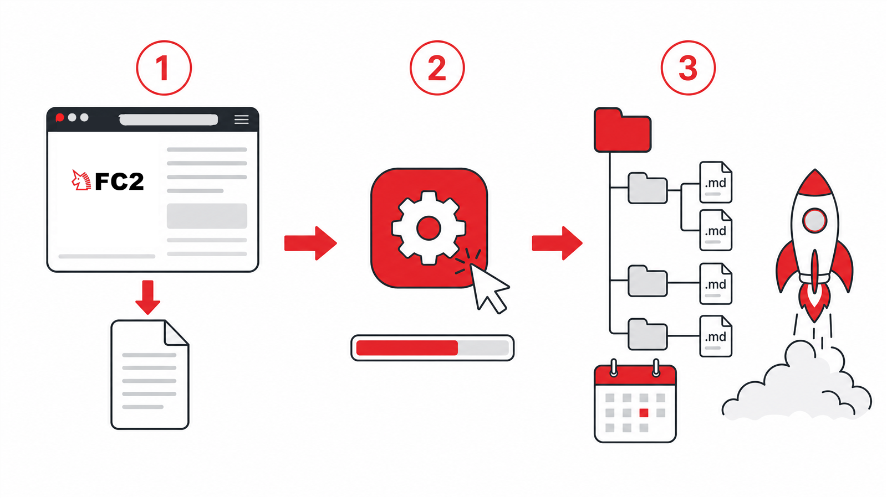

# fc2blog-to-markdown

FC2 ブログのエクスポートファイルを、日付ごとの Markdown ファイルへ変換するツールです。
FC2 ブログを使い続けながら、記事をいつでも手元へバックアップできます。
Astro のような静的サイトジェネレーターへ記事を移す準備にも使えます。



## できること

- FC2 からエクスポートしたファイルを、記事 1 本ずつの .md ファイルへ変換します
- タイトル・日付・カテゴリー・タグを、各ファイルの先頭へ書き込みます
- カテゴリーを選んで、一部の記事だけを変換できます
- 記事に貼られた FC2 の画像をまとめてダウンロードし、記事から参照できるようにします
- 記事に付いたコメントも一緒に残します
- 表示できなくなった埋め込み（アクセス解析タグ、終了したサービスの動画）を取り除きます

## 使い方

Windows 10 と Windows 11 で動作します。用意するものはパソコンだけです。変換に必要な Python は、スクリプトが自動で用意します。

1 FC2 ブログの管理画面で [ツール] → [データのバックアップ] を開き、記事データをエクスポートしてテキストファイルとして保存します。

2 このページの上にある [Code] → [Download ZIP] からファイル一式をダウンロードし、ZIP を展開します。

3 展開したフォルダーをエクスプローラーで開きます。アドレスバーに `powershell` と入力して Enter キーを押すと、そのフォルダーで PowerShell の画面が開きます。

4 次の 1 行をコピーして PowerShell の画面へ貼り付け、Enter キーを押します。

```powershell
powershell -NoProfile -ExecutionPolicy Bypass -File .\run-convert.ps1
```

5 あとは画面の質問に答えるだけです。ファイル選択画面で手順 1 のファイルを選び、変換するカテゴリー・保存先・画像をダウンロードするかを答えると、変換が始まります。すべての質問は Enter キーだけで答えられます（記事全部を `output` フォルダーへ変換し、画像もダウンロードします）。

変換が終わると、保存先のフォルダーが自動で開きます。中には年ごとのフォルダーに分かれた .md ファイルが並びます。1 つの .md ファイルが 1 記事です。

動作を試すだけなら、手順 5 のファイル選択で、展開したフォルダーの中にある `sample/sample-fc2-export.txt` を選んでください。架空の記事 6 本を変換して、出来上がるファイルを確認できます。

手順 4 の `-ExecutionPolicy Bypass` は、ダウンロードしたスクリプトを Windows がブロックしないようにするための指定です。この 1 回の実行にだけ効くもので、パソコンの設定は変わりません。

## うまくいかないときは

- 赤い文字でエラーが表示された場合は、その文章が原因です。インターネット接続を確認して、手順 4 からやり直してください
- 変換できるのは、FC2 の管理画面からエクスポートしたテキストファイルだけです。ZIP のままでは変換できません
- 初回は Python の準備に数分かかります。画面が止まって見えても、そのまま待ってください
- 答えを間違えた場合は、PowerShell の画面を閉じて手順 4 からやり直してください。そのとき保存先には新しいフォルダー名（例: `output2`）を指定してください。前回の結果が残ったまま混ざるのを防げます

## 注意事項

- **画像のダウンロードは、ブログを閉鎖する前に実行してください。** ブログを削除すると、FC2 上の画像も取得できなくなります
- エクスポートファイルには、未公開の下書きやコメント投稿者の情報が含まれることがあります。エクスポートファイルと変換結果は、公開リポジトリやインターネット上の共有フォルダーへ置かないでください

## 詳しい資料

- コマンドラインでの使い方、オプション、出力される .md ファイルの仕様、macOS と Linux での実行 → [docs/cli.md](docs/cli.md)
- コードの構成と FC2 エクスポート形式の仕様 → [docs/ARCHITECTURE.md](docs/ARCHITECTURE.md)

## License

[MIT](LICENSE)
